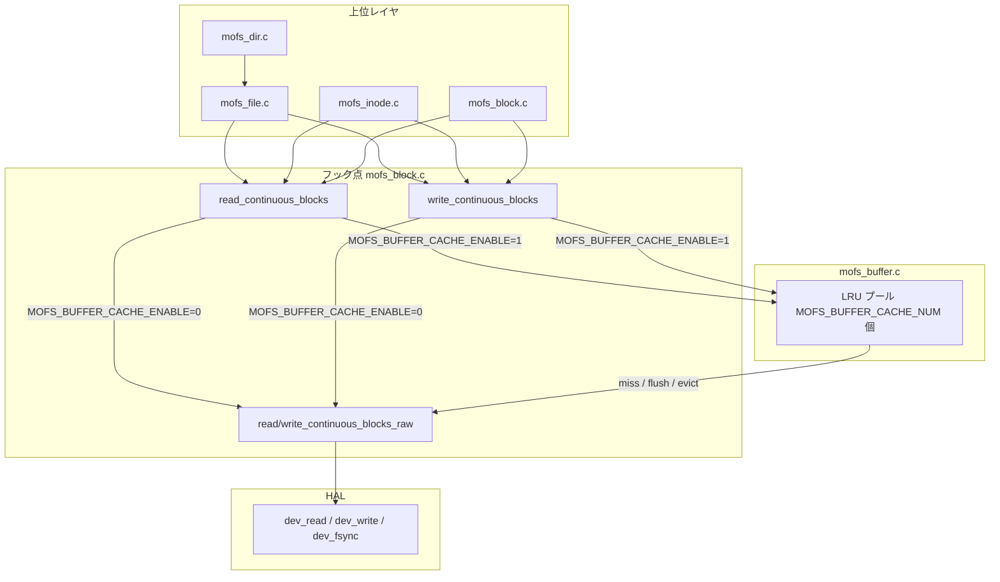
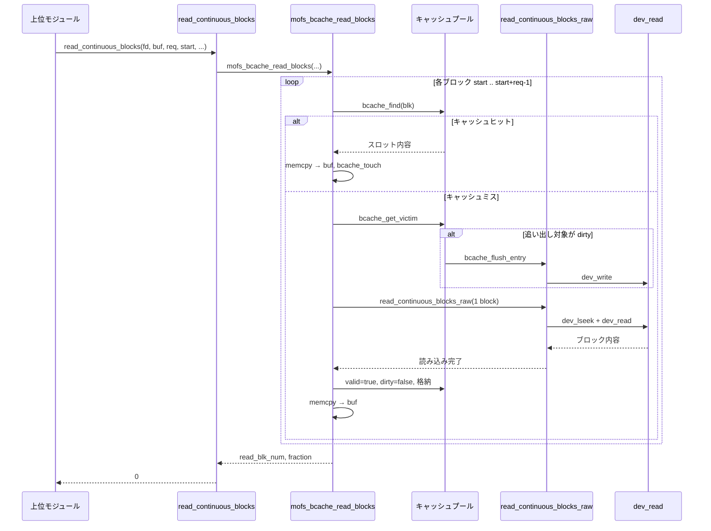
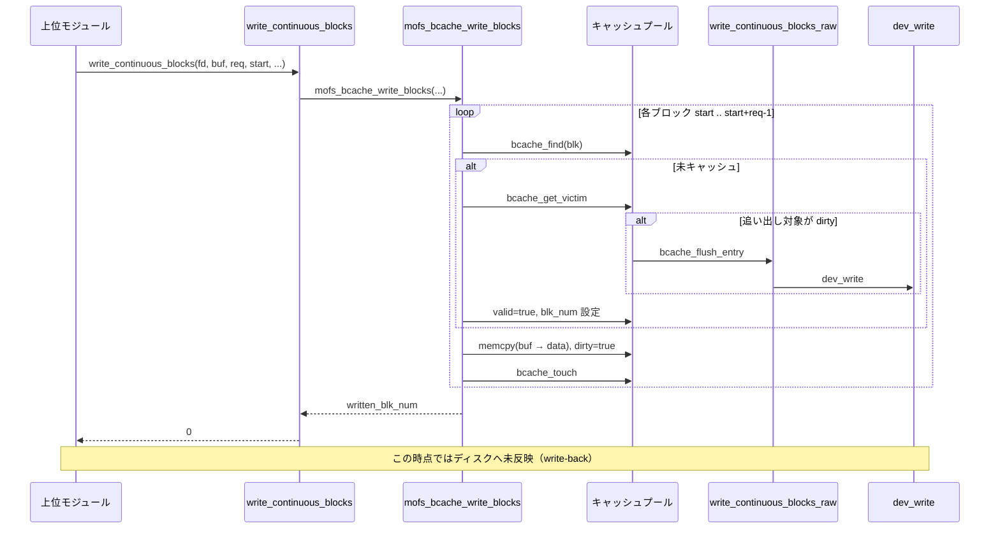
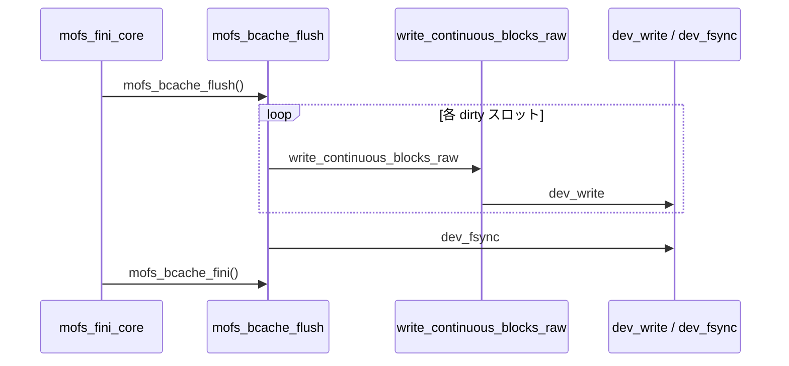
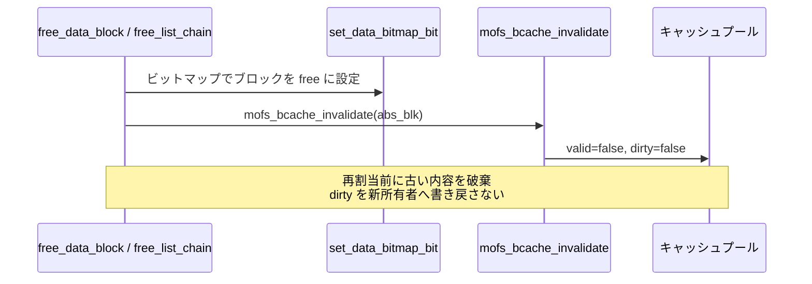

# MOFS バッファキャッシュ

MOFS core がデバイス上の論理ブロックを読み書きする際、メモリ上にブロック内容を保持して I/O を省略する write-back 方式のバッファキャッシュ。

## 全体概要

### 目的

すべてのブロック I/O は `read_continuous_blocks` / `write_continuous_blocks` に集約されている。キャッシュ有効時、これらの入口で `mofs_buffer.c` のキャッシュ層を経由し、同一ブロックへの繰り返しアクセスをメモリで処理する。

主な効果:

- **read**: キャッシュヒット時はディスク読み込みを省略
- **write**: write-back により書き込みはまずキャッシュへ反映し、追い出し・フラッシュ・アンマウント時にディスクへ書き出す
- inode テーブル・bitmap・list node・ファイルデータなど、用途を問わず同一プールを共有

### アーキテクチャ



### キャッシュエントリ

各スロットは絶対ブロック番号（`abs_blk`）をキーに 1 論理ブロック分を保持する。

| フィールド | 説明 |
|-----------|------|
| `valid` | スロットが有効なブロックを保持しているか |
| `dirty` | デバイスと内容が異なるか（write-back 用） |
| `blk_num` | 絶対ブロック番号 |
| `lru_tick` | LRU 追い出し用の最終アクセス時刻 |
| `data` | `ctx.sp_blk.blk_size` バイトのブロック内容 |

### 置換・永続化ポリシー

| 操作 | 動作 |
|------|------|
| キャッシュミス | 空きスロットを使用。なければ LRU で追い出し（dirty なら先に flush） |
| write | キャッシュへ memcpy し `dirty=true`。この時点ではディスクへ書かない |
| 追い出し | dirty スロットは `write_continuous_blocks_raw` で書き出してから再利用 |
| `mofs_bcache_flush` | 全 dirty スロットを書き出し、`dev_fsync` で同期 |
| `mofs_bcache_invalidate` | スロットを破棄（dirty でも書き戻さない）。ブロック解放・再割当前に使用 |
| アンマウント | `mofs_bcache_flush` → `mofs_bcache_fini` |

### ビルド時設定

[`src/core/include/mofs_config.h`](../src/core/include/mofs_config.h) に既定値があり、CMake で上書き可能。

| マクロ / オプション | 既定値 | 説明 |
|--------------------|--------|------|
| `MOFS_BUFFER_CACHE_ENABLE` | `1` | `1`: 有効 / `0`: 無効 |
| `MOFS_BUFFER_CACHE_NUM` | `64` | プール内バッファ数 |
| CMake `MOFS_ENABLE_BUFFER_CACHE` | `ON` | `MOFS_BUFFER_CACHE_ENABLE` を compile definition で渡す |

キャッシュ有効時はマウントで `O_SYNC` を付けず、永続化は `mofs_bcache_flush` と `dev_fsync` に委ねる。無効時は従来どおり `O_SYNC` 付きで直接 I/O する。

メモリ使用量（概算）: `MOFS_BUFFER_CACHE_NUM × ctx.sp_blk.blk_size`（例: 64 × 4096 = 256 KiB）。

---

## キャッシュが使用される処理

キャッシュは **`read_continuous_blocks` / `write_continuous_blocks` を呼ぶすべての処理** に透過的に適用される。上位 API を直接呼ぶ必要はない。

### 間接的にキャッシュを利用する処理

| モジュール | 処理 | 対象ブロック |
|-----------|------|-------------|
| `mofs_file.c` | ファイル read / write / truncate | ファイルデータブロック |
| `mofs_dir.c` | ディレクトリ read / readdir 等 | ファイルデータブロック（`read_file_data_block` 経由） |
| `mofs_inode.c` | inode 読み書き | inode テーブルブロック |
| `mofs_inode.c` | inode 割当・解放 | inode bitmap ブロック |
| `mofs_block.c` | データブロック割当・解放 | data bitmap ブロック |
| `mofs_block.c` | list node 読み書き | データリストノードブロック |
| `mofs_block.c` | `free_data_block` / `free_list_chain` | 解放時に `mofs_bcache_invalidate` を呼ぶ |

### キャッシュを経由しない I/O

| 処理 | 理由 |
|------|------|
| スーパーブロック読み込み（`mofs_init_core`） | `dev_read` を直接呼ぶ（マウント前） |
| `mkfs`（`mofs_format.c`） | core キャッシュ未初期化 |
| キャッシュ内部の miss / flush / evict | `read/write_continuous_blocks_raw` でバイパス |

---

## API 仕様

ヘッダ: [`src/core/include/mofs_buffer.h`](../src/core/include/mofs_buffer.h)（core 内部 API。外部公開ヘッダではない）

戻り値は成功時 `0`、失敗時は `MOFS_E*` 正の整数。

### `mofs_bcache_init`

```c
int mofs_bcache_init(void);
```

| 項目 | 内容 |
|------|------|
| 呼び出し元 | `mofs_init_core`（`ctx.sp_blk` 確定後） |
| 動作 | `MOFS_BUFFER_CACHE_NUM` 個分のブロックバッファを確保しプールを初期化 |
| 成功 | `0`（既に初期化済みの場合も `0`） |
| 失敗 | `MOFS_EINVAL`（blk_size 未設定）、`get_errno()`（メモリ不足等） |

### `mofs_bcache_fini`

```c
void mofs_bcache_fini(void);
```

| 項目 | 内容 |
|------|------|
| 呼び出し元 | `mofs_fini_core`、初期化失敗時のクリーンアップ |
| 動作 | プールのメモリを解放。dirty の flush は行わない |
| 前提 | 呼び出し前に `mofs_bcache_flush` 済みであること |

### `mofs_bcache_read_blocks`

```c
int mofs_bcache_read_blocks(int fd, void *buf,
                            unsigned int req_blk_num, unsigned int start_blk_num,
                            unsigned int *read_blk_num, mofs_size_t *fraction);
```

| パラメータ | 説明 |
|-----------|------|
| `fd` | デバイス fd（未使用。API 互換のため受け取る） |
| `buf` | 読み込み先バッファ |
| `req_blk_num` | 要求ブロック数 |
| `start_blk_num` | 開始絶対ブロック番号 |
| `read_blk_num` | 出力: 読み込めた完全ブロック数 |
| `fraction` | 出力: 末尾短読の有効バイト数（通常は `0`） |

キャッシュ未初期化時は `read_continuous_blocks_raw` にフォールバックする。

### `mofs_bcache_write_blocks`

```c
int mofs_bcache_write_blocks(int fd, const void *buf,
                             unsigned int req_blk_num, unsigned int start_blk_num,
                             unsigned int *written_blk_num, mofs_size_t *fraction);
```

write-back: 各ブロックをキャッシュへコピーし `dirty=true` にする。この API 呼び出し時点ではディスクへ書かない。`fraction` はキャッシュ経路では常に `0`。

### `mofs_bcache_flush`

```c
int mofs_bcache_flush(void);
```

| 項目 | 内容 |
|------|------|
| 動作 | 全 dirty スロットを raw 書き込みし、続けて `dev_fsync` |
| 呼び出し元 | `mofs_fini_core` |
| 成功 | `0`（未初期化時も `0`） |

### `mofs_bcache_invalidate`

```c
int mofs_bcache_invalidate(unsigned int blk_num);
```

| 項目 | 内容 |
|------|------|
| 動作 | `blk_num` のキャッシュエントリを破棄（dirty でも書き戻さない） |
| 呼び出し元 | `free_list_chain`、`free_data_block` |
| 戻り値 | 常に `0` |

### ディスパッチャ（`mofs_block.h`）

上位モジュールが呼ぶ公開 API。内部でキャッシュ有無を切り替える。

```c
int read_continuous_blocks(...);   /* ENABLE=1 → mofs_bcache_read_blocks */
int write_continuous_blocks(...);  /* ENABLE=1 → mofs_bcache_write_blocks */

int read_continuous_blocks_raw(...);   /* キャッシュバイパス（miss/flush 用） */
int write_continuous_blocks_raw(...);
```

---

## read / write 時のシーケンス

以下は `MOFS_BUFFER_CACHE_ENABLE=1` かつキャッシュ初期化済みの場合。

### Read シーケンス



**ポイント**

- ヒット時はディスク I/O なし
- ミス時のみ raw 経由で 1 ブロック読み込み
- プールが満杯のとき、LRU スロットを追い出す（dirty なら先に flush）

### Write シーケンス（write-back）



**ポイント**

- 呼び出し時点ではメモリへの反映のみ
- ディスクへの書き込みは追い出し・`mofs_bcache_flush`・アンマウント時

### フラッシュ（アンマウント）シーケンス



### ブロック解放時の invalidate シーケンス



`free_data_block` ではビットマップ解放直後（`rebuild_data_block_list` による再割当前）に invalidate する。関数末尾での一括 invalidate だと、再割当済みの新しい list node 内容まで破棄してしまうため、タイミングに注意する。

---

## 関連ファイル

| ファイル | 役割 |
|---------|------|
| `src/core/modules/mofs_buffer.c` | キャッシュ本体 |
| `src/core/include/mofs_buffer.h` | core 内部 API 宣言 |
| `src/core/include/mofs_config.h` | ビルド時設定マクロ |
| `src/core/modules/mofs_block.c` | ディスパッチャ、raw I/O、invalidate 呼び出し |
| `src/core/modules/mofs_core.c` | init / flush / fini、O_SYNC 切替 |
| `src/port/include/mofs_devio.h` | `dev_fsync` 宣言 |
