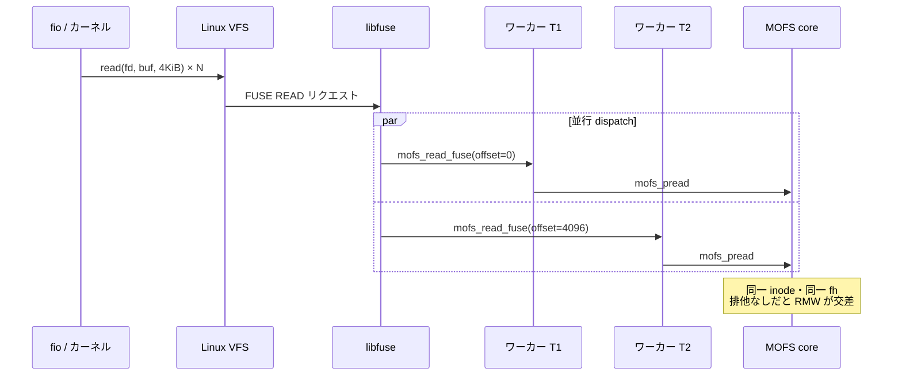
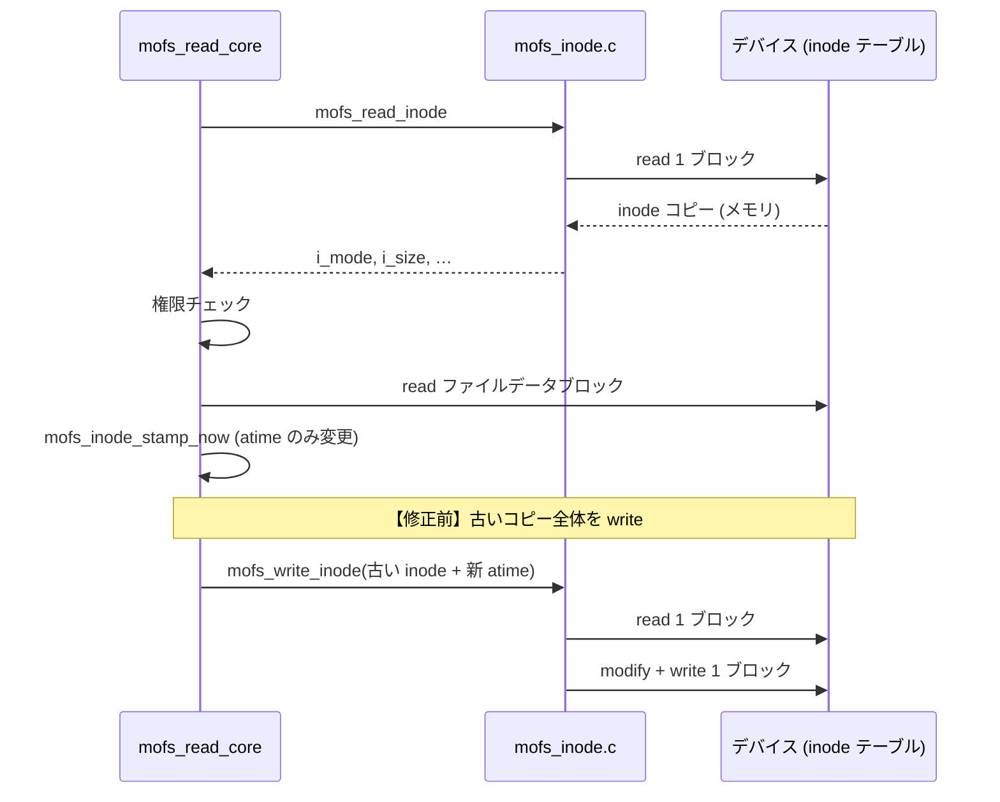
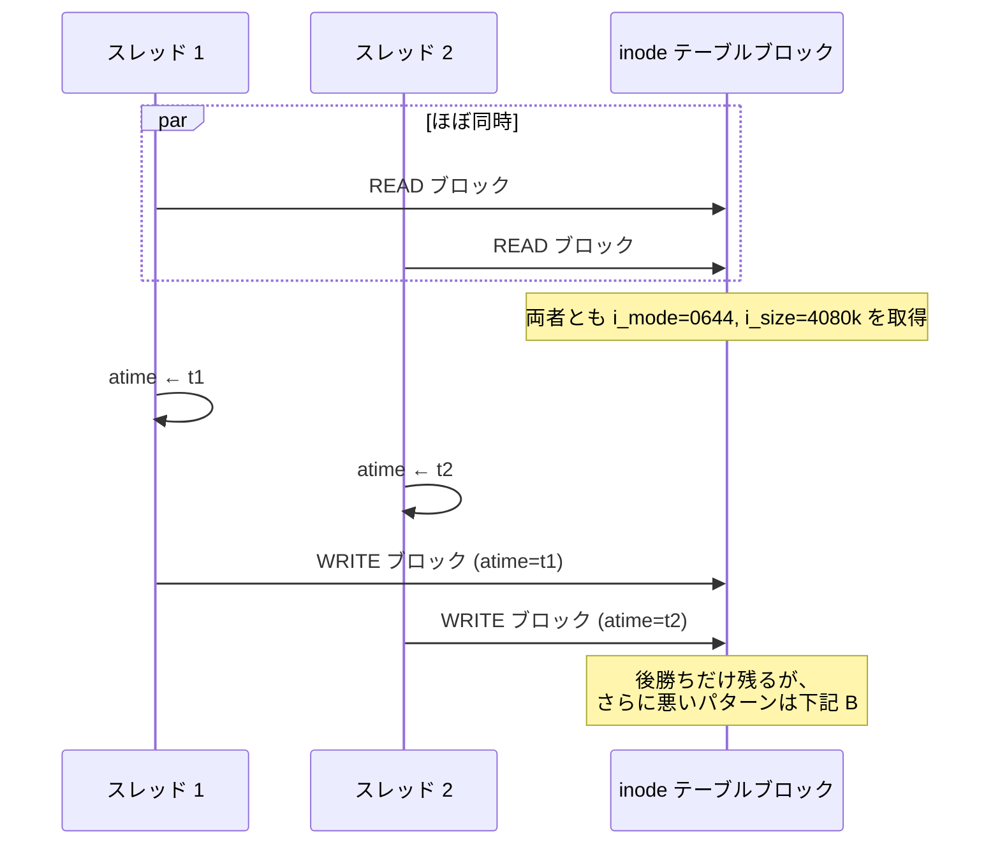
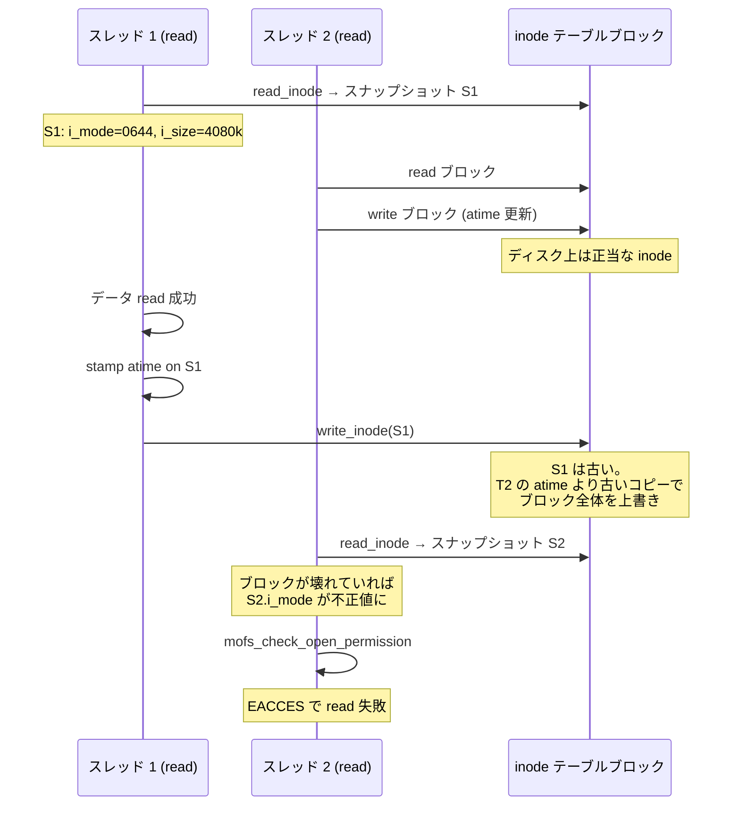
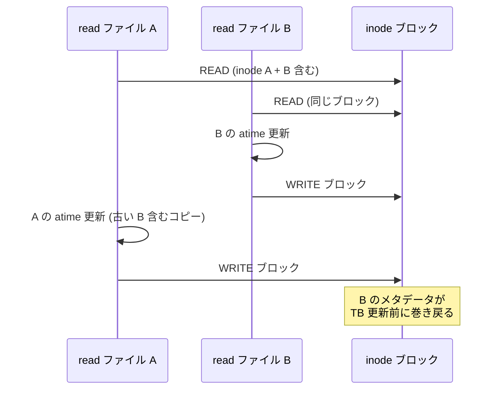
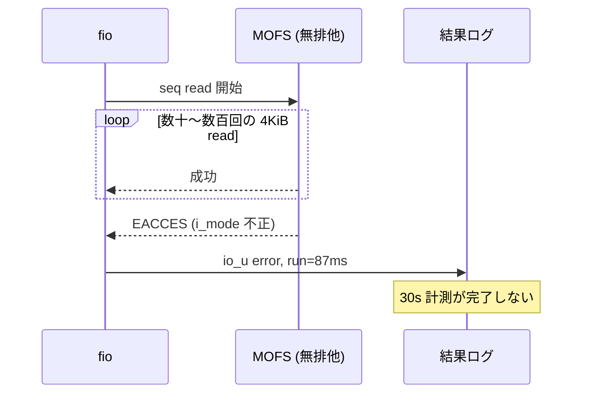
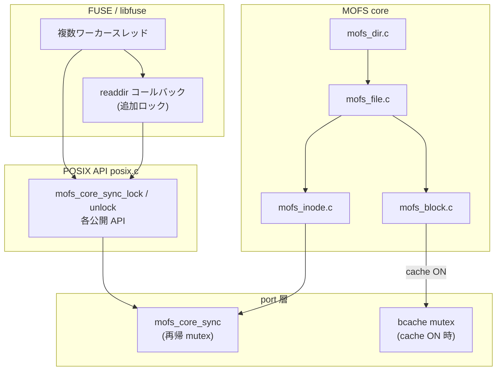
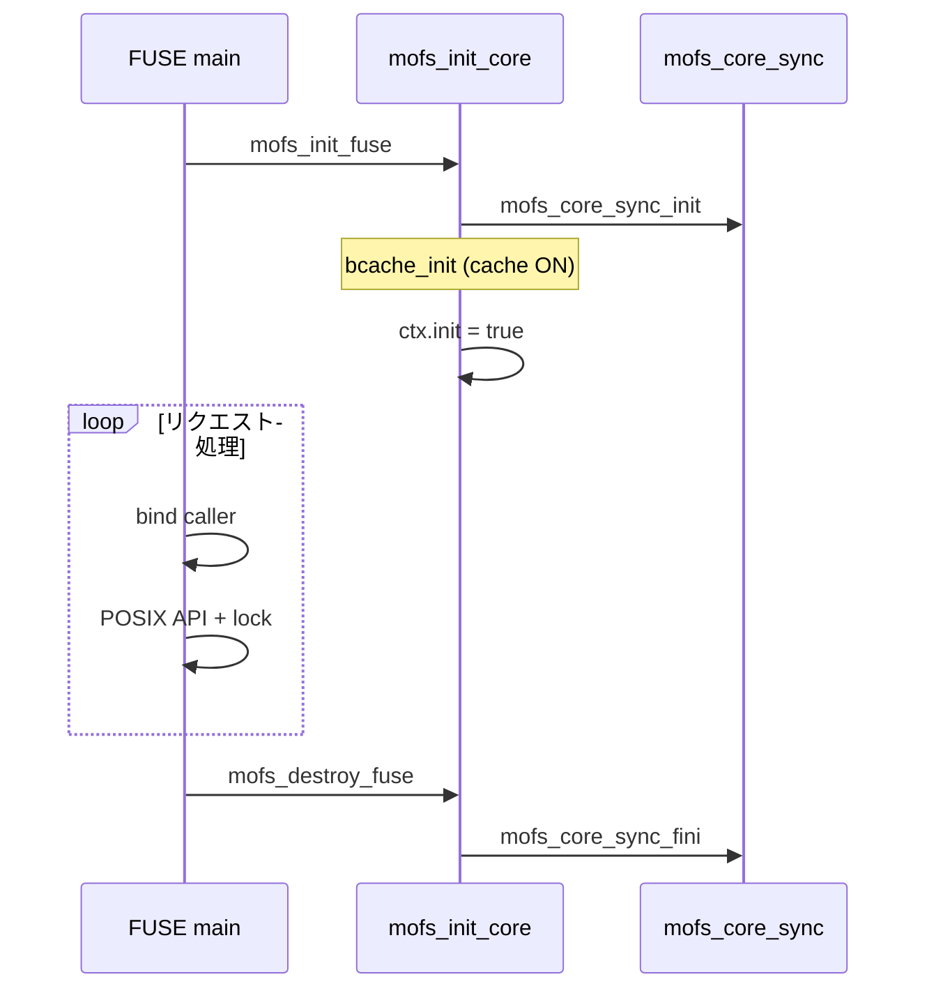

# MOFS 排他制御（マルチスレッド安全性）

libfuse は既定で FUSE リクエストを複数スレッドで処理する。MOFS core は inode テーブル・ディレクトリブロック・ファイルデータ・list node などを **read-modify-write (RMW)** で更新するため、並行アクセスをそのまま許すとメタデータ破壊や I/O エラーが発生する。
また libfuse に関わらず、マルチスレッドによるファイルアクセスが可能な環境では同様の問題が発生しうる。

本ドキュメントは、MOFS がその競合をどのように防いでいるかを説明する。バッファキャッシュ固有の話は [buffer_cache.md](buffer_cache.md) も参照。

---

## 背景：何が起きていたか

### マルチスレッドが入る経路

MOFS を FUSE 経由でマウントすると、典型的な呼び出し経路は次のとおり。

```
アプリ (fio 等)
  → VFS / ページキャッシュ
    → /dev/fuse
      → libfuse ワーカースレッドプール（既定で複数スレッド）
        → mofs_read_fuse / mofs_getattr_fuse …
          → POSIX API (mofs_pread 等)
            → MOFS core
```

libfuse は `-s` を付けない限り **リクエストごとに別スレッド** からコールバックが呼ばれる。`fio` のジョブ数が 1 でも、カーネルの **read-ahead** や **getattr** などが並行して飛び、**同一ファイル・同一 `fi->fh`** に対する `read` が複数スレッドで重なることがある。

キャッシュ ON / OFF どちらでも core 側の RMW は発生する。キャッシュはブロック I/O の経路を変えるだけで、inode 更新やディレクトリエントリ更新の **論理的な RMW パターン** 自体は残る。



---

### 1 回の read が inode ブロックを触る

`mofs_read_core`（[`mofs_file.c`](../src/core/modules/mofs_file.c)）は、データブロック read のほか **atime 更新** のために inode テーブルブロックを書き換える。修正前は read 開始時に読んだ `mofs_inode_t` 全体を書き戻していた。



1 論理ブロック（通常 4 KiB）に **複数 inode** が詰まっている。別 inode 同士の更新でも **同じ物理ブロック** を read → modify → write するため、ブロック単位の RMW が競合しやすい。

---

### 競合パターン A：inode ブロックの lost update

2 スレッドが **同じファイル** を同時 read すると、両方とも同じ inode スロットの atime を更新しようとする。排他がなければ次の交差が起きる。



この程度なら atime だけ失われ、他フィールドは同一コピー起点なので破壊しない場合もある。**問題は read と write の途中で別操作が割り込むケース**。

---

### 競合パターン B：古い inode 全体の書き戻し（修正前）

修正前の read パスでは、**read 開始時点の inode スナップショット** に atime だけ足して `mofs_write_inode` していた。並行更新と組み合わさると **意図しないフィールドの巻き戻し** が起きる。



`i_mode` の permission bit がゼロ化したり、`i_size` が異常に小さくなったりすると、以降の read が **`EACCES`** や **`EINVAL`**（offset > i_size）で途中終了する。

---

### 競合パターン C：同一ブロック上の別 inode

inode テーブルは 1 ブロックに複数エントリ。ファイル A とファイル B の inode が同じブロックにある場合、A の atime 更新と B の atime 更新が交差すると、**A の書き込みが B のエントリを巻き戻す**（またはその逆）が起きうる。



パターン H（多数小ファイルの randread）のように **メタデータ操作が密集** するワークロードほど再現しやすい。

---

### 競合パターン D：ディレクトリ・ファイルデータの RMW

inode 以外も RMW である。

| 対象 | 操作例 | 競合時のリスク |
|------|--------|----------------|
| ディレクトリブロック | `add_dir_entry` / `remove_dir_entry` | エントリ消失、二重登録、ENOENT |
| ファイルデータブロック | write の read-modify-write | 部分書き込みの欠落 |
| list node | `allocate_data_block` | ポインタ不整合 → EIO |
| ビットマップ | inode / data 割当 | 二重割当、リーク |

read 中心のベンチマーク（パターン A〜C）では **inode atime** が最も頻繁に踏まれる。write / mixed rw（E, F, G）や mkdir / unlink では D も顕在化する。

---

### ベンチマークで観測された症状

`test/os/linux/benchmark/run_throughput_benchmarks.sh` を **libfuse マルチスレッド + 排他制御なし** で実行した際の例:

| パターン | 症状 | おおよその意味 |
|----------|------|----------------|
| A (seq read 4MiB) | 数百 ms で停止、`EACCES` @ offset ≈ 512 KiB | 100 回以上 read 後に `i_mode` 破壊 |
| B (seq read 128 KiB) | 早期 `EINVAL` | `i_size` 破壊で offset が EOF 超過と判定 |
| C (seq read 512 KiB) | 同上 | 同上 |
| G_1m (mixed rw) | `EIO` @ offset 1 MiB | setup が 3072 KiB なのに benchmark が 4080 KiB を前提（スクリプト不整合）+ メタデータ競合 |
| G_4k (mixed rw) | write で `EACCES` | inode 破壊後の権限チェック失敗 |

fio ログ上は `func=io_u error` として記録され、**計測時間が 30 s ではなく 100 ms 未満** で終了することが多い（I/O エラーでジョブ abort）。



errno と core 側の対応（まとめ）:

| errno（OS） | MOFS 側 | 典型原因 |
|-------------|---------|----------|
| `EACCES` (13) | `MOFS_EACCES` | `i_mode` 破壊で read bit 消失 → `mofs_check_open_permission` 失敗 |
| `EPERM` (1) | `MOFS_EPERM` | caller コンテキスト不正（稀。多くは EACCES） |
| `EINVAL` (22) | `MOFS_EINVAL` | `i_size` 破壊で offset ≥ size と判定 |
| `EIO` (5) | `MOFS_EIO` | list node / ブロックマッピング不整合、サイズ不整合 |

---

### 一時回避策 `-s` とその限界

FUSE 起動時に **`-s`（シングルスレッド）** を付けると、libfuse がコールバックを 1 スレッドで直列実行するため、上記 RMW 交差は起きにくい。ベンチマークは `-s` のみで通過した。

| 手段 | 効果 | 限界 |
|------|------|------|
| `-s` | 実装変更なしで競合回避 | FUSE 側の並列性ゼロ。マルチコアを活かせない |
| inode のみ lock | atime 競合は減る | ディレクトリ・データ RMW、古いコピー書き戻しは残る |
| **POSIX 入口 + inode RMW + stamp_persist**（現行） | `-s` なしで正しさ確保 | ボリューム全体直列化。スループットは今後の改善余地 |

現行実装は最後の行を採用している。詳細は以降の章を参照。

---

## 設計方針

| 方針 | 内容 |
|------|------|
| **pthread を core に置かない** | 同期 primitives は port 層 [`mofs_port_sync.h`](../src/port/include/mofs_port_sync.h) の API 経由。Linux 実装は [`os_sync.c`](../src/os/linux/service/os_sync.c) |
| **入口で直列化** | FUSE → POSIX → core の経路では、POSIX 公開 API ごとにグローバルロックを取得 |
| **inode RMW を局所保護** | core 内部やテストから `_core` API を直接呼ぶ場合にも、inode テーブル操作は追加で保護 |
| **atime は部分更新** | read 後の atime 更新は inode 全体の書き戻しではなく、タイムスタンプフィールドのみ RMW |
| **再帰 mutex** | POSIX ロック内から core / inode ヘルパが再度ロックしてもデッドロックしない |

現状は **ボリューム全体を 1 mutex で直列化** するシンプルなモデル。スループットより正しさを優先している。

---

## 全体構成



### 3 層の役割

| 層 | 場所 | 保護対象 |
|----|------|----------|
| **1. POSIX API** | [`posix.c`](../src/posix/posix.c) | stat / open / close / pread / pwrite / truncate / unlink / mkdir / rmdir / opendir / readdir / closedir など、FUSE から到達する操作全体 |
| **2. inode テーブル** | [`mofs_inode.c`](../src/core/modules/mofs_inode.c) | inode ブロックの read / write / タイムスタンプ部分更新 |
| **3. バッファキャッシュ** | [`mofs_buffer.c`](../src/core/modules/mofs_buffer.c) | キャッシュプール操作・`mofs_bcache_modify_block`（**cache ON 時のみ**） |

層 1 が最も外側のゲート。層 2・3 は core 内部の RMW を直接呼ぶ経路（テスト、将来の非 POSIX クライアント）向けの二重防御でもある。

---

## `mofs_core_sync`（グローバル再帰 mutex）

### API

[`mofs_port_sync.h`](../src/port/include/mofs_port_sync.h) で宣言:

```c
int  mofs_core_sync_init(void);
void mofs_core_sync_fini(void);
void mofs_core_sync_lock(void);
void mofs_core_sync_unlock(void);
```

| 関数 | タイミング |
|------|------------|
| `mofs_core_sync_init` | `mofs_init_core` 内。スーパーブロック読み込み後、`ctx.init = MOFS_TRUE` の前 |
| `mofs_core_sync_fini` | `mofs_fini_core` 内。デバイスクローズ前 |
| `lock` / `unlock` | POSIX API、inode ヘルパ、FUSE `readdir` など |

Linux 実装では `PTHREAD_MUTEX_RECURSIVE` を使用。同一スレッドからのネストした `lock` はカウントされ、対応する回数の `unlock` で解放される。

`core_sync_ready` が 0 の間（init 前・fini 後）は lock / unlock は no-op。init / fini 自体はマウント／アンマウント時の単一スレッドを想定。

### 汎用 mutex API

同ヘッダの `mofs_mutex_*` は **bcache 専用** など、別用途向けの汎用ラッパ。`mofs_core_sync` とは独立した mutex インスタンス。

---

## POSIX 層でのロック

[`posix.c`](../src/posix/posix.c) の各公開関数は、引数検証の後（または直前）に `mofs_core_sync_lock` を取得し、core 呼び出し完了後に `unlock` する。

### ロック対象 API

- `mofs_stat`
- `mofs_open` / `mofs_close`
- `mofs_pread` / `mofs_pwrite`（`mofs_read` / `mofs_write` もここ経由）
- `mofs_truncate` / `mofs_ftruncate`
- `mofs_unlink`
- `mofs_mkdir` / `mofs_rmdir`
- `mofs_opendir` / `mofs_readdir` / `mofs_closedir`

### 複数 core 呼び出しの原子性

`mofs_truncate(path, length)` は **1 ロック内** で次を実行する:

1. `mofs_path_to_inode_num`
2. `mofs_truncate_core`

パス解決と truncate を別 API 呼び出しに分割すると、其の間に別スレッドが同じファイルを変更しうるため、POSIX 層でまとめている。

---

## inode テーブル操作

[`mofs_inode.c`](../src/core/modules/mofs_inode.c)

### `mofs_read_inode`

inode テーブルブロックの read を `mofs_core_sync_lock` 内で実行。書き込み中のブロックを read して中途半端な inode を拾うことを防ぐ。

### `mofs_write_inode`

キャッシュ **ON** 時はまず `mofs_bcache_modify_block` を試行（bcache mutex 下で原子的パッチ）。キャッシュに載っていない等で `MOFS_EINVAL` が返った場合、またはキャッシュ **OFF** 時は `mofs_core_sync` 下でブロック RMW:

1. read 1 ブロック
2. 対象 inode エントリを上書き
3. write 1 ブロック

### `mofs_inode_stamp_persist`

read パスでの **atime 更新専用**。`mofs_read_core` から呼ばれる。

```
lock → read inode ブロック → タイムスタンプのみ更新 → write ブロック → unlock
```

以前は read 開始時に読んだ inode 構造体全体を `mofs_write_inode` で書き戻していた。並行 atime 更新と組み合わさると、古い `i_mode` / `i_size` で上書きする **lost update** が起きうる。`stamp_persist` はロック内で最新ブロックを read してからタイムスタンプだけを変更する。

マスク定数（[`mofs_inode.h`](../src/core/include/mofs_inode.h)）:

| 定数 | 更新フィールド |
|------|----------------|
| `MOFS_INODE_TIME_ATIME` | `i_atime` |
| `MOFS_INODE_TIME_MTIME` | `i_mtime` |
| `MOFS_INODE_TIME_CTIME` | `i_ctime` |

write / mkdir 等の **メタデータ全体の更新** は引き続き `mofs_write_inode` を使用（POSIX ロック下では呼び出し全体が直列化される）。

---

## バッファキャッシュ層（cache ON 時）

[`mofs_buffer.c`](../src/core/modules/mofs_buffer.c)

| 機構 | 説明 |
|------|------|
| `bcache_lock` | プールスロットの lookup / insert / evict / flush を直列化 |
| `mofs_bcache_modify_block` | 1 論理ブロック内の部分更新を bcache mutex 下で RMW |

`mofs_write_inode`（cache ON）は modify_block 成功時、bcache 側だけで inode パッチが完結する。

`mofs_core_sync`（POSIX 直列化）と bcache mutex は **別 mutex**。典型経路では POSIX が先に core_sync を取るため、実質 core 操作は順次実行される。bcache mutex は主にキャッシュデータ構造自体の整合性用。

詳細は [buffer_cache.md](buffer_cache.md) の「スレッド安全性」を参照。

---

## FUSE 層の追加対応

[`fuse_ops.c`](../src/os/linux/tools/fuse/fuse_ops.c)

### マルチスレッド起動

[`fuse.c`](../src/os/linux/tools/fuse/fuse.c) は libfuse 既定（`-s` なし）で起動。リクエスト処理スレッドプールを利用する。

### `readdir` の原子性

`mofs_readdir_fuse` は 1 コールバック内で:

```
opendir → readdir ループ → closedir
```

を行う。各 `mofs_opendir` / `mofs_readdir` / `mofs_closedir` は POSIX 層でも個別に lock するが、**ループの反復間で lock が解放される**と、別スレッドが同じディレクトリを変更しうる。

そのため `mofs_readdir_fuse` 全体を `mofs_core_sync_lock` で囲み、1 回の readdir 要求を原子的に扱う（再帰 mutex により POSIX 内 lock と共存）。

### 呼び出し元コンテキスト

各 FUSE コールバックは `mofs_fuse_bind_request_caller` で `fuse_get_context()` の uid / gid / pid をスレッドローカルな caller コンテキスト（[`os_user.c`](../src/os/linux/service/os_user.c) の `__thread` 変数）へ設定してから POSIX API を呼ぶ。

---

## ライフサイクル



---

## ロックされない経路

| 経路 | 備考 |
|------|------|
| **`mofs_*_core` を直接呼ぶテスト** | [`test/core/`](../test/core/)、[`test/posix/`](../test/posix/) など。単一スレッド実行を前提 |
| **`mofs_init_core` / `mofs_fini_core`** | マウント／アンマウント時のみ。FUSE `init` / `destroy` から単一スレッドで呼ばれる |
| **format (`mofs_format`)** | mkfs ツール経由。マウント前 |

新しい core クライアントを書く場合は、POSIX 層を経由するか、自前で `mofs_core_sync` を適切な粒度で取得すること。

---

## 直列化の影響と今後

### 現状のトレードオフ

- **利点**: 実装が単純で、inode / ディレクトリ / ファイルデータ / list node 間のデッドロックを設計段階で排除しやすい
- **欠点**: 同一ボリュームへの操作がグローバルに直列化されるため、マルチスレッド FUSE でも **I/O スループットは実質シングルスレッドに近い**

ベンチマーク（`fio` ジョブ数 1）では `-s` 時代と同等の正しさを確認している。

### 将来の細分化案（未実装）

| 案 | 概要 |
|----|------|
| inode 単位ロック | 異なるファイルへの並行 read/write を許可 |
| ブロック番号単位ロック | list node や bitmap 更新の粒度を下げる |
| reader-writer lock | read 多・write 少のワークロード向け |

いずれも RMW の境界（「どの操作を 1 原子単位とみなすか」）の設計が必要。現行のグローバル mutex はその前段階として機能する。

---

## 関連ソース一覧

| ファイル | 役割 |
|----------|------|
| [`src/port/include/mofs_port_sync.h`](../src/port/include/mofs_port_sync.h) | 同期 API 宣言 |
| [`src/os/linux/service/os_sync.c`](../src/os/linux/service/os_sync.c) | Linux 実装（pthread） |
| [`src/posix/posix.c`](../src/posix/posix.c) | POSIX 公開 API の lock / unlock |
| [`src/core/modules/mofs_core.c`](../src/core/modules/mofs_core.c) | init / fini で `mofs_core_sync_*` |
| [`src/core/modules/mofs_inode.c`](../src/core/modules/mofs_inode.c) | inode RMW、`stamp_persist` |
| [`src/core/modules/mofs_file.c`](../src/core/modules/mofs_file.c) | read 後の atime → `stamp_persist` |
| [`src/core/modules/mofs_buffer.c`](../src/core/modules/mofs_buffer.c) | bcache mutex（cache ON） |
| [`src/os/linux/tools/fuse/fuse_ops.c`](../src/os/linux/tools/fuse/fuse_ops.c) | readdir 追加ロック |
| [`src/os/linux/tools/fuse/fuse.c`](../src/os/linux/tools/fuse/fuse.c) | マルチスレッド FUSE 起動 |

---

## 変更履歴メモ

- libfuse マルチスレッド下でのベンチマーク失敗（uncached / cached）を契機に、`-s` 依存から POSIX + inode + bcache の 3 層排他へ移行
- atime 更新を `mofs_inode_stamp_persist` に分離し、inode 全体 lost update を解消
